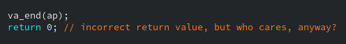

# Лабораторная Lab2 SCR1 sim

## Задание

|Вид исключения|Тест	            |Reset Vector	|Trap Vector   | При обработке
|----------|---------------- |------------ |----------- |---------------
|Illegal instruction|isa/rv32mi/illegal.S |0х400        |0x200     | Вывод строки «ILLEGAL»

## Выполнение

Для выполнения лабораторной работы были выполнены следующие действия:

1. Изменить список тестов *[riscv32_tests.inc](../sim/tests/riscv_isa/rv32_tests.inc)*, оставить только одну строчку с тестом по варианту, как например

    ```
        rv32_isa_tests += isa/rv32mi/illegal.S
    ```

2. Модифицировать обработку исключений, чтобы при ней выводилась определенная строка. Для этого редактируется файл *[riscv_macros.h](../sim/tests/common/riscv_macros.h)* :
    1. Объявляется секция *.data* с нужной строкой перед секцией *.text.init*

        ```
        .section .data;	
        IT_FINALLY_WORKS: .string "ILLEGAL\n";
        ```

    2. В начале *trap_vector* проверяется значение mcause, если оно не равно 2, то пропускается вывод строки, так как 2 это код исключения illegal instruction

        ```
        trap_vector:
            csrr a4, mcause;
            /* check if it is illegal instruction */
            andi t0, a4, 0x03;
            addi t0, t0, -2;
            bnez t0, cont;
        ```

    3. Потом выводится строка, для этого каждый символ строки сохраняется по адресу *0xF0000000*

        ``` 
            /* load string address */
            la t1, IT_FINALLY_WORKS;
            /* load print character address */
            li t2, 0xF0000000;	
            /* load and print character */
        loop: lb t3, 0(t1);	
            sb t3, 0(t2);				
		    beqz t3, cont;
		    addi t1, t1, 1;
		    j loop;					
            /* test whether the test came from pass/fail */
        cont: li a5, CAUSE_USER_ECALL; 
        ```					

3. Установить в файле *[scr1_arch_description.svh](../src/includes/scr1_arch_description.svh)* параметры ядра Reset Vector и Trap Vector в соответствии с вариантом задания.

    ```
        // Default address constants (if scr1_arch_custom.svh is not used)
        parameter bit [`SCR1_XLEN-1:0]          SCR1_ARCH_RST_VECTOR        = 'h400;
        // Reset vector value (start address after reset)
        parameter bit [`SCR1_XLEN-1:0]          SCR1_ARCH_MTVEC_BASE        = 'h200;
    ```

4. Изменить linker-скрипт *[link.ld](../sim/tests/common/link.ld)* и участвующие в сборке файлы программы для корректного запуска теста с новыми значениями Reset Vector и Trap Vector.
    * Изменение *[riscv_macros.h](../sim/tests/common/riscv_macros.h)*
        1. Убрать строчку

            ```
            .org 0xC00, 0x00;
            ```

        2. Объявить новую секцию *.text.start* перед _start

            ```
            .section .text.start:
            _start:
                    RISCV_MULTICORE_DISABLE;
            ```

    * Изменение *[link.ld](../sim/tests/common/link.ld)* 
        1. Выставить новый адрес обработчика исключений в секции *.text.init*

            ```
            . = 0x200;
            ```

        2. Задать новый адрес для секции *.text.start*, где 400<sub>16</sub>=1024<sub>10</sub>

            ```
            .text.start 1024 : {
                *(.text.start)
            } > RAM
            ```

## Результаты

* Из результата симуляции **test_results.txt** видно, что был выбран только необходимый тест и тест успешно выполнился.
* Из дампа теста **illegal.dump** видно, что trap_vector корректно установлен по адресу 0x200, а _start по адресу 0x400
* Из трейслога **tracelog_core_0.log** видно, что процессор начинает работать с адреса 0х400 и при возникновении exception переходит по адресу 0x200.

P.S. )

